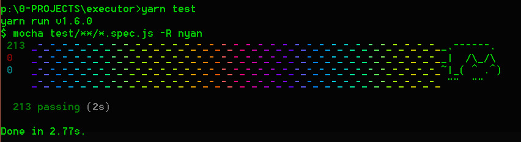
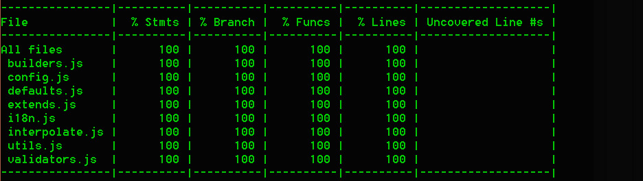

# executor
### **_A powerful "short-cutter" to your console for you and your team!_**

[](https://raw.githubusercontent.com/crystian/executor/master/LICENSE) 
[](https://circleci.com/gh/crystian/executor/tree/master) 
[](https://coveralls.io/github/crystian/executor)
[](https://www.bithound.io/github/crystian/executor)
[](https://www.bithound.io/github/crystian/executor/master/dependencies/npm)
[](https://www.bithound.io/github/crystian/executor/master/dependencies/npm)

[English version (under construction)](README.md)

---
## TL;DR

Este herramienta te va a permitir ahorrar gran cantidad de tiempo de escritura de comandos con atajos totalmente personalizados, con la finalidad de compartirlo con un proyecto, tanto para que lo usen personas como máquinas, manteniéndose unificado y en un único lugar. #agile #needForSpeed. 
 
Como `scripts` de `package.json` pero con _magia_.

**Notes:** La idea no es dejar de usar la consola, es la de optimizarla.
  
### Features

* Multiplataforma: Único código, funciona en todas las plataformas. Powered by [nodejs](https://nodejs.org)
* Multi-configuracion, con múltiples niveles de anidamiento.
* Templates para su facil reutilizacion.
* No importa el tipo de proyecto, si escribis comandos esta herramienta te puede ser útil.
* Utilización de variables predefinidas, ambiente, template y de otros 'shortcuts' (atajos).
* Devs y DevOps pueden ser amigos con esta tool, ya que comparten sus comandos.
* Errores de tipeos en comandos largos, son problemas del pasado!
* Pare de sufrir! Basta de mil scripts similares en tu `package.json`!  
(`build`, `build-ci`, `build-prod`, `build-prod-ci`, `build-qa`, `build-qa-ci`, `build-ci-cache`, etc...)
* Modificaste `scripts` del `package.json` y tenes que 'rebuilder' tu imagen de docker... nunca mas!
* **Sin dependencias de otros módulos de node!**


---

# Table of content

* [Extended version](#extended-version)
* [Concepts](#concepts)
* [Typical scenario](#typical-scenario)
* [Installation](#installation)
* [Configuration](#configuration)
	* [config](#config)
	* [environments](#environments)
	* [templates](#templates)
	* [shortcuts](#shortcuts)
	* [predefined](#predefined)
* [Bonus track](#bonus-track)
	+ [Config file](#config-file)
	+ [Config file sample](#config-file-sample)
* [contributing](#contributing)
* [Changelog](#changelog)
* [Coming soon](#coming-soon)


## Extended version

Esta tool cuenta con deliciosos features el cual nos debería ahorra mucho tipeo (y errores de) que al final del dia cuenta, pero la gracia es que se pueda compartir con todo el equipo y en un único lugar: "el repo".

## Concepts

* **Tool:** Este software/herramienta, puntualmente el comando "`e`".
* **CWD:** Current Working Directory (directorio actual).
* **Comando:** Programa ejecutable con posibilidad de enviarle múltiples argumentos.  
* **Consola:** "Ventana" desde donde se puede ejecutar comandos.
* **CLI:** [Command line Interface](https://en.wikipedia.org/wiki/Command-line_interface) Ejecutable para trabajar en la consola, tipeando comandos con argumentos.
* **Template** Generalmente un texto con partes estáticas y otras dinámicas que se reemplazaran en tiempo de ejecucion.
* **Interpolar** Reemplazar por valores de variables  

## Typical scenario

### Problem

Vamos a los bifes con un **ejemplo** rapido asi se entiende mejor el concepto:

Simulemos que tenemos dos comandos recurrentes:
```
docker run --rm -it --name myProject-dev myProject-dev ash
docker run --rm -it --name myProject-prod myProject-prod ash
```
Constantemente tenes que escribir lo anterior, y se pone más divertido con los mapeos:
```
docker run --rm -it -p 4200:4200 -p 49153:49153 -v /choclo:... --name myProject-dev myProject-dev ash 
docker run --rm -it -p 4200:4200 -p 49153:49153 -v /choclo:... --name myProject-prod myProject-prod ash  
```

Para esto llegó `scripts` de npm en el `package.json`! Nos debería quedar algo asi:
```
"runDev": "docker run --rm -it -p 4200:4200 -p 49153:49153 -v /choclo:... --name myProject-dev myProject-dev ash"
"runProd": "docker run --rm -it -p 4200:4200 -p 49153:49153 -v /choclo:... --name myProject-prod myProject-prod ash" 
```
Para luego ejectuar: `npm run runDev` o `npm run runProd`.
 
Pero como vemos, hay "código" repetido, y si multiplicamos por variables, podrían ser muchas líneas con pequeñas diferencias y si cambiamos algo en alguna de ellas potencialmente tenes que replicarlo en el resto, y como buenos programadores que somos evitamos el duplicado (no?).

### Solution
Necesitamos algo más dinámico que permita escalar mejor. El _approach_ elegido para solucionar esto es el de "templetear", con una configuración similar a esta:

```
"project"="myProject"
"devName"="${project}-dev"
"prodName"="${project}-prod"
"dockerRun"="docker run --rm -it -p 4200:4200 -p 49153:49153 -v /choclo:... --name"
"runDev" =${dockerRun} ${devName} ${devName} ash
"runProd"=${dockerRun} ${prodName} ${prodName} ash
```
Y luego ejectuaria con: `e runDev` o `e runProd`.

Ahora, imaginemos que todo el equipo de trabajo tiene la misma configuración, comandos rapidos y normalizados, hablariamos el mismo idioma y podríamos sentirnos como en "casa" frente a otra máquina!

  
# Installation

### Requirements

* [Node/npm](https://nodejs.org)
* `executor.json`: **archivo de configuración** de atajos (ya veremos cómo se construye).

### Global

Lo ideal es instalarlo globalmente, de otra manera deberías ejecutar `node_modules\.bin\e`, lo cual claramente dejaría de ser un atajo.

Instalemos global con npm o yarn:  

* npm: `npm install -g executor`
* yarn: `yarn add global executor` (de preferencia)

El executable que deberia quedar en el [path](https://en.wikipedia.org/wiki/PATH_(variable)) es la simple vocal: `e`

Para comprobar que fue instalado, ejecutamos en la consola: `e`, no importa donde, debería devolverte un error como este:
```
[executor] File not found: "executor.json"
```

### Executable

Como ya te habrás dado cuenta el comando es `e` más los shortcuts configurados en el archivo de configuración.  
Ejemplo: `e shortcut1`

### Notes
Este comando (`e`) es un CLI que se ejecuta en el contexto donde es ejecutado, o sea, que lee los archivos del directorio actual donde se ejecute, por ende si no encuentra el archivo de configuración dará un error como el anterior.

# Configuration

A.k.a: `executor.json`


Toda la magia se configura desde este archivo. Como mencione antes **no es necesario un proyecto "node"**, esta tool sirve para cualquier tipo de proyecto en el que quieras tener atajos de comandos.

## Json structure

Ramas principales:
```
{
  config: {}
  environments: []
  templates: {}
  shortcuts: {}
}
```

### config

Configuración adicional para la ejecución de los shortcuts.

* `dry`: _boolean_ = `false`  
Permite ejecutar esta tool pero no ejecuta el comando, útil para debuguear y armar nuevos comandos.
* `showTime`: _boolean_ = `true`  
Muestra el tiempo total de ejecución al final del mismo.
* `showCommand`: _boolean_ = `true`  
Muestra el comando a ejecutar.    
Nota: Si `dry` esta activo, se mostrará el comando sin importar el estado de `showCommand`.
* `useColors`: _boolean_ = `true`  
La salida de la consola se mostrará con colores, si interfiere con los colores de tu consola, podes cancelarlo con `false`
* `colors`: {`primary`, `secondary`, `alert`}  
Se pueden customizar estos colores, utilizar esta [tabla](https://stackoverflow.com/questions/9781218/how-to-change-node-jss-console-font-color).


### environments

Variables del ambiente que se quieran "importar".  
El formato aceptado es `string` u objeto key-value (`{key: value}`); Luego podremos usar como variable a `${key}`

Ejemplos:
```
environments: {
  'path',                // traeria todo el path de la maquina en ejecucion
  {currentFolder: 'pwd'} // leera la variable pwd (CWD de linux) y la asignara a "currentFolder"
}
```

Luego se expondrán para que los templates/shortcuts puedan utilizar esta info utilizando el objeto `environments`.  
Ejemplo: `"PATH: ${environments.path} and ${environments.currentFolder}"`  

### templates

Son los `string`s que pueden servir para armar varios shortcuts, con la consiguiente reutilización y fácil mantenimiento.

#### Use  
Se "interpola" con el delimitador: '`${ }`', esto permite armar `string`s en formato de template, donde habrá placeholders (marcas) que serán reemplazados por el valor de la variable dentro del delimitador.  

Ejemplo:
```
templates: {
  "variable1": "foo",
  "variable2": "${variable1} bar" 
}
```
El resultado sera: `foo bar`


#### Features
 
* Se pueden hacer templates con templates anidados.  
Ejemplo: `templates: {templateUnion: "${template1} and ${template2}"}`
* Se pueden usar variables de ambiente como comentaba el apartado anterior.  
Ejemplo: `templates: {template1: "PATH: ${environments.path} and ${environments.currentFolder}"}` 
* Se pueden crear subobjetos para tenerlo mejor organizado  
Ejemplo: `imageName` 
```
templates: {
  "project": "myProject",
  "imageName": {
    "base": "${project}-base",
    "dev": "${project}-dev",
    "prod": "${project}-prod"
  }
}
```
* Se puede acceder a sub-objetos utilizando el operador: '`.`'  
Ejemplo: `Imagen: ${imageName.prod}`, resultado: `myProyect-prod`
* Soporta infinito número de subobjetos


**Notes:**  
1) No se interpola utilizando el feature de ECMAScript, se realiza un replace.  
2) El orden es importante, los templates deben definirse antes de utilizarse. 


### shortcuts

Llegamos a los famosos "shortcuts", se interpola de la misma manera que los templates, con lo cual hereda sus features, y agrega:

* Podemos no tener la entidad `templates` y utilizar otros shortcuts como tales.
* Cada sub-objeto no solo sirve como separador como en el caso de templates, sino que también es un separador de argumentos.  
Ejemplo _(disculpas por lo burdo, es para que se entienda)_: 
```
templates: {
  "project": "myProject",
  "imageName": {
    "prod": "${project}-prod"
  }
}
shortcuts: {
  changeDir: "cd ${imageName.prod}", // unico argumento
  removeDir: "rm ${imageName.prod}", // unico argumento
  
  dir: {                             // primer argumento
    change: "cd ${imageName.prod}",  // segundo argumento
    remove: "rm ${imageName.prod}"   // segundo argumento 
  },
  
  showCommandChangeDir: "echo ${dir.change}" // unico argumento, y utilizaria el "." como un template 
}
```
Los shortcuts listos para ejecutar serian:
```
> e changeDir
> e removeDir
> e dir change
> e dir remove
> e showCommandChangeDir
```

En este ejemplo podemos ver tres casos:  
1) Ejecución con 1 solo argumento  
2) Ejecución con 2 argumentos  
3) Ejecución con 1 solo argumento, pero internamente lo armo con el operador de '`.`' como si fuese un template.
  
Como podemos ver queda a nuestro exclusivo criterio como queremos formarlo, la flexibilidad está dada.

**Tip:** En mi caso particular, prefiero: "subject + verb" en 2 argumentos. Si bien no es gramaticalmente correcto, me es más útil para alternar comandos ya que muchas veces lo que más me cambia son los verbos entre comandos (generalizando obviamente). Como el caso de `e dir change`

### predefined

También tenemos algunos valores predefinidos (read-only) para poder usar en los templates, por el momento solo el `cwd`, luego la lista irá creciendo "on demand".  
Ejemplo: `'echo este es el folder actual: ${predefined.cwd}'`

* `cwd`: directorio actual sin importar el sistema operativo.

### Summary

Con lo cual, para conformar los shortcuts y sin repetir "código" tenes 4 fuentes en este orden:

1) `environments`
2) `predefined`
3) `templates`
4) `shortcuts`

Los parámetros siguientes al último argumento se enviaran al shortcut tal cual fueron enviados.
Ejemplo: `e mochaShortcut --watch` 


## Bonus track

### Config file
De yapa, si por X causa no te gusta el nombre del archivo "executor.json" o lo queres ubicar en otro directorio, podes hacerlo configurandolo desde el `package.json` (ahora si estamos hablando de un proyecto node), agregando este atributo:  
```
"executor": {
  "configFile": "folder1/newConfig.json"
}
```
### Config file sample

Este es un caso completo y complejo:

```
{
  "config": {
    "dry": false
  },
  "environments": [
    "pwd"
  ],
  "templates": {
    "project": "myProyect",
    "imageName": {
      "base": "${project}-base",
      "dev": "${project}-dev",
      "prod": "${project}-prod"
    },
    "build": "docker build -t",
    "run": "docker run --rm --init -d --name",
    "stop": "docker stop",
    "exec": "docker exec -it",
    "logs": "docker logs",
    "attach": "docker attach",
    "config": {
      "prod": "${run} ${imageName.prod} -it -p 80:80 -p 443:443",
      "dev": "${run} ${imageName.dev} -it -p 4200:4200 -p 49153:49153 -v /usr/src/server/node_modules -v ${predefined.cwd}:/usr/src/server -v yarn-cache:/home/node/yarn-cache -v npm-cache:/home/node/npm-cache"
    }
  },
  "shortcuts": {
    "base": {
      "build": "${build} ${imageName.base} -f Dockerfile-base",
      "run": "${run} ${imageName.base} -it ${imageName.base}",
      "exec": "${exec} ${imageName.base}",
      "enter": "${exec} ${imageName.base} ash",
      "stop": "${stop} ${imageName.base}"
		},
    "dev": {
      "build": "${build} ${imageName.dev} .",
      "run": "${config.dev} ${imageName.dev}",
      "start": "${exec} ${imageName.dev} yarn start",
      "serve": "${config.dev} ${imageName.dev} yarn start",
      "attach": "${attach} ${imageName.dev}",
      "exec": "${exec} ${imageName.dev}",
      "enter": "${exec} ${imageName.dev} ash",
      "stop": "${stop} ${imageName.dev}",
      "logs": "${logs} ${imageName.dev}"
    },
    "prod": {
      "build": "${build} ${imageName.prod} .",
      "run": "${config.prod} ${imageName.prod} ash",
      "start": "${exec} ${imageName.prod} node index",
      "serve": "${config.prod} ${imageName.prod}",
      "attach": "${attach} ${imageName.prod}",
      "exec": "${exec} ${imageName.prod}",
      "enter": "${exec} ${imageName.prod}",
      "stop": "${stop} ${imageName.prod}",
      "logs": "${logs} ${imageName.prod}"
    }
  }
}
```

# contributing

Si queres colaborar con este proyecto, podes hacerlo con feedback, reporte de issues o desarrollo de features, pull requests son bienvenidos!

Luego de bajar el repo, instalar "devDependecies" las unicas que tienen son de unit test :)

`npm install` or `yarn`

`yarn test`: Ejecuta los test con un hermoso "nyan cat"

 

`yarn coverage`: Debe ser el 100%, minimo aceptado: 98%.



# Changelog

 
# Coming soon

* Feature: Utilización de un `executor.json` **global**!
* Doc: Video de 5' demostrando funcionalidad
* Doc: Mejorar el ejemplo completo
* Internal: Agregar linter

---

MIT © 2018 [Crystian](https://github.com/crystian), hecho con amor para vos <3!
